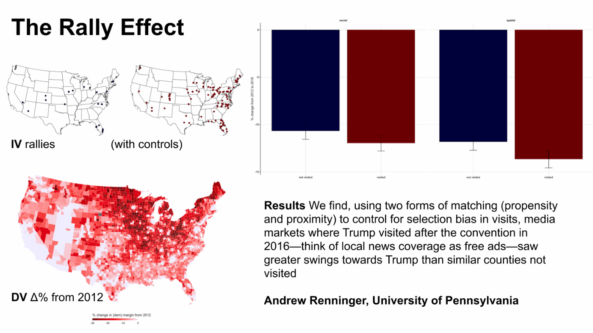

# twentysixteen
### an analysis of the presidential contest with an eye on health, wealth, and communication

Attempting to distill whether or not campaign communication can sway an election, we use matching techniques to compare 2016 election results in like counties with like. We use counties that are close in either geographic and demographic space, some either hosted a rally or saw one on local news whiles others did not, to see if voting patterns differed. Though not a perfect substitute for random assignment, these pairs—proximity matched or propensity matched—swung more to Trump if he rallied nearby. Presented to the Political and Computational Social Science conference, the slides can be found [here](https://raw.githubusercontent.com/asrenninger/twentysixteen/master/viz/renninger_pacss2020.gif).   

